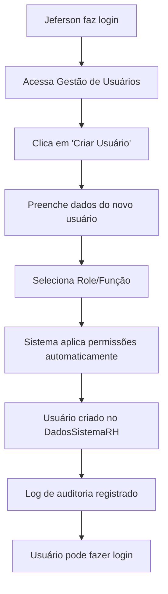

# 👥 Sistema de Usuários e Permissões

## 🎯 Visão Geral

Sistema completo de gestão de usuários com níveis hierárquicos de permissões e usuário master para administração total do sistema.

## 👤 Usuário Master Criado

### 🔐 **Credenciais do Desenvolvedor Principal**
- **Nome**: Jeferson
- **Email**: jeferson@sistemahr.com
- **Senha**: 873090As#27
- **Função**: Desenvolvedor
- **Status**: Usuário Master (isMaster: true)
- **Departamento**: Desenvolvimento

### 🔑 **Poderes do Usuário Master**
- ✅ Criar outros usuários
- ✅ Editar qualquer usuário 
- ✅ Deletar usuários (exceto própria conta)
- ✅ Gerenciar todas as roles/funções
- ✅ Acessar logs de auditoria completos
- ✅ Gerenciar configurações do sistema
- ✅ Acesso total a todos os dados
- ✅ Proteção contra exclusão por outros usuários

## 📋 Hierarquia de Roles/Funções

### 1. 🔧 **Desenvolvedor** (Nível Máximo)
```javascript
permissions: {
  canCreateUsers: true,      // ✅ Criar usuários
  canEditUsers: true,        // ✅ Editar usuários
  canDeleteUsers: true,      // ✅ Deletar usuários
  canManageRoles: true,      // ✅ Gerenciar funções
  canViewAudit: true,        // ✅ Ver auditoria
  canManageSystem: true,     // ✅ Gerenciar sistema
  canAccessAllData: true     // ✅ Acesso total
}
```

### 2. 👑 **Administrador**
```javascript
permissions: {
  canCreateUsers: true,      // ✅ Criar usuários
  canEditUsers: true,        // ✅ Editar usuários
  canDeleteUsers: true,      // ✅ Deletar usuários
  canManageRoles: true,      // ✅ Gerenciar funções
  canViewAudit: true,        // ✅ Ver auditoria
  canManageSystem: false,    // ❌ Sem acesso ao sistema
  canAccessAllData: true     // ✅ Acesso total dados
}
```

### 3. 📊 **Gerente RH**
```javascript
permissions: {
  canCreateUsers: true,      // ✅ Criar usuários
  canEditUsers: true,        // ✅ Editar usuários
  canDeleteUsers: false,     // ❌ Não pode deletar
  canManageRoles: false,     // ❌ Não gerencia funções
  canViewAudit: true,        // ✅ Ver auditoria
  canManageSystem: false,    // ❌ Sem acesso ao sistema
  canAccessAllData: true     // ✅ Acesso total dados
}
```

### 4. 📝 **Analista RH**
```javascript
permissions: {
  canCreateUsers: false,     // ❌ Não cria usuários
  canEditUsers: true,        // ✅ Editar usuários
  canDeleteUsers: false,     // ❌ Não pode deletar
  canManageRoles: false,     // ❌ Não gerencia funções
  canViewAudit: false,       // ❌ Sem ver auditoria
  canManageSystem: false,    // ❌ Sem acesso ao sistema
  canAccessAllData: false    // ❌ Acesso limitado
}
```

### 5. 🎯 **Recrutador**
```javascript
permissions: {
  canCreateUsers: false,     // ❌ Não cria usuários
  canEditUsers: false,       // ❌ Não edita usuários
  canDeleteUsers: false,     // ❌ Não pode deletar
  canManageRoles: false,     // ❌ Não gerencia funções
  canViewAudit: false,       // ❌ Sem ver auditoria
  canManageSystem: false,    // ❌ Sem acesso ao sistema
  canAccessAllData: false    // ❌ Acesso limitado
}
```

## 🔧 Métodos de Gestão de Usuários

### 🔐 **Autenticação**
```javascript
// Login do usuário master
const user = await UserService.authenticateUser(
  'jeferson@sistemahr.com', 
  '873090As#27'
);

if (user) {
  console.log('✅ Login realizado:', user.name);
  console.log('🔑 Permissões:', user.permissions);
} else {
  console.log('❌ Credenciais inválidas');
}
```

### 👥 **Criar Novo Usuário**
```javascript
// Jeferson criando um novo administrador
const jeferson = await UserService.getUserByEmail('jeferson@sistemahr.com');

await UserService.createUser({
  name: 'João Silva',
  email: 'joao@empresa.com',
  role: 'Administrador',
  department: 'Recursos Humanos',
  password: 'MinhaSenh@123',
  createdBy: 'Jeferson'
}, jeferson); // Passa o usuário criador para verificação

console.log('✅ Usuário criado com permissões de Administrador');
```

### ✏️ **Editar Usuário**
```javascript
// Alterar role de um usuário (requer permissão canManageRoles)
await UserService.updateUser(
  'user-id-123',
  {
    role: 'Gerente RH',  // Permissões serão atualizadas automaticamente
    department: 'RH Operacional'
  },
  'Jeferson',
  jeferson // Usuário que está fazendo a alteração
);
```

### 🗑️ **Deletar Usuário**
```javascript
// Deletar usuário (exceto usuário master)
await UserService.deleteUser(
  'user-id-456',
  'Jeferson',
  jeferson // Usuário que está fazendo a exclusão
);
```

## 🛡️ Sistema de Validações

### 🔒 **Proteções Implementadas**

#### **Usuário Master**
- ❌ Não pode ser deletado por ninguém
- ✅ Sempre tem todas as permissões
- ✅ Pode deletar a própria conta (caso extremo)

#### **Validações de Permissão**
```javascript
// Verificar se usuário pode criar outros
if (UserService.canCreateUsers(currentUser)) {
  // Mostrar botão "Criar Usuário"
}

// Verificar se pode editar
if (UserService.canEditUsers(currentUser)) {
  // Mostrar botão "Editar"
}

// Verificar se pode ver auditoria
if (UserService.canViewAudit(currentUser)) {
  // Mostrar relatórios de auditoria
}
```

#### **Auto-Proteção**
- ❌ Usuários não podem deletar própria conta (exceto master)
- ✅ Verificação de email único
- ✅ Validação de role existente
- ✅ Senhas obrigatórias

## 📊 Métodos Utilitários

### 📈 **Estatísticas de Usuários**
```javascript
const stats = await UserService.getUserStats();
console.log(stats);
// {
//   total: 5,
//   active: 4,
//   inactive: 1,
//   byRole: {
//     'Desenvolvedor': 1,
//     'Administrador': 2,
//     'Analista RH': 2
//   },
//   byDepartment: {
//     'Desenvolvimento': 1,
//     'RH': 4
//   }
// }
```

### ✅ **Validação de Dados**
```javascript
const validation = UserService.validateUserData({
  name: 'Ana Costa',
  email: 'ana@empresa.com',
  role: 'Analista RH',
  department: 'Recursos Humanos',
  password: 'Senha123@'
});

if (validation.isValid) {
  console.log('✅ Dados válidos');
} else {
  console.log('❌ Erros:', validation.errors);
}
```

### 📋 **Listar Roles Disponíveis**
```javascript
const roles = UserService.getAvailableRoles();
console.log('Funções disponíveis:', roles);
// ['Desenvolvedor', 'Administrador', 'Gerente RH', 'Analista RH', 'Recrutador']
```

## 🔄 Fluxo de Criação de Novos Usuários

### 📝 **Processo Padrão**


### 🔐 **Exemplo Prático**
```javascript
// 1. Jeferson faz login
const jeferson = await UserService.authenticateUser(
  'jeferson@sistemahr.com', 
  '873090As#27'
);

// 2. Cria um gerente de RH
await UserService.createUser({
  name: 'Maria Santos',
  email: 'maria@empresa.com',
  role: 'Gerente RH',
  department: 'Recursos Humanos',
  password: 'GerenciaRH@2024',
  createdBy: 'Jeferson'
}, jeferson);

// 3. Maria pode fazer login e terá automaticamente as permissões de Gerente RH
const maria = await UserService.authenticateUser(
  'maria@empresa.com', 
  'GerenciaRH@2024'
);

// 4. Maria pode criar um analista (tem permissão canCreateUsers: true)
await UserService.createUser({
  name: 'Pedro Oliveira',
  email: 'pedro@empresa.com',
  role: 'Analista RH',
  department: 'Recursos Humanos',
  password: 'Analise@2024',
  createdBy: 'Maria'
}, maria);
```

## 📁 Estrutura de Dados

### 🗄️ **Arquivo usuarios.json (DadosSistemaRH)**
```json
[
  {
    "id": "1",
    "email": "jeferson@sistemahr.com",
    "name": "Jeferson",
    "role": "Desenvolvedor",
    "department": "Desenvolvimento",
    "password": "873090As#27",
    "isActive": true,
    "isMaster": true,
    "permissions": {
      "canCreateUsers": true,
      "canEditUsers": true,
      "canDeleteUsers": true,
      "canManageRoles": true,
      "canViewAudit": true,
      "canManageSystem": true,
      "canAccessAllData": true
    },
    "createdAt": "2024-01-15T10:00:00Z",
    "createdBy": "Sistema Inicial",
    "lastUpdate": "2024-01-15T10:00:00Z",
    "description": "Usuário master - Desenvolvedor principal do sistema"
  }
]
```

## 🔐 Segurança e Auditoria

### 📝 **Logs Automáticos**
- ✅ Criação de usuários
- ✅ Edição de dados e permissões
- ✅ Tentativas de login
- ✅ Mudanças de role/função
- ✅ Tentativas de exclusão

### 🛡️ **Proteções de Segurança**
- ✅ Senhas não retornadas em consultas
- ✅ Validação de permissões em todas as operações
- ✅ Usuário master protegido contra exclusão
- ✅ Email único por usuário
- ✅ Roles validadas contra lista predefinida

## 🧪 Testes do Sistema

### ✅ **Teste de Login Master**
```javascript
console.log('🧪 Testando login do usuário master...');

const masterUser = await UserService.authenticateUser(
  'jeferson@sistemahr.com',
  '873090As#27'
);

if (masterUser && masterUser.isMaster) {
  console.log('✅ Login master funcionando');
  console.log('👤 Usuário:', masterUser.name);
  console.log('🔑 Permissões completas:', 
    UserService.canManageSystem(masterUser));
} else {
  console.log('❌ Falha no login master');
}
```

### ✅ **Teste de Criação de Usuário**
```javascript
console.log('🧪 Testando criação de usuário...');

try {
  await UserService.createUser({
    name: 'Teste Usuario',
    email: 'teste@empresa.com',
    role: 'Analista RH',
    department: 'Teste',
    password: 'Teste123@',
    createdBy: 'Jeferson'
  }, masterUser);
  
  console.log('✅ Usuário criado com sucesso');
} catch (error) {
  console.log('❌ Erro na criação:', error.message);
}
```

## 📞 Suporte

### 🔧 **Contato do Desenvolvedor Master**
- **Nome**: Jeferson
- **Email**: jeferson@sistemahr.com
- **WhatsApp**: (82) 99915-8412
- **Login Sistema**: jeferson@sistemahr.com / 873090As#27

### 📚 **Documentos Relacionados**
- `CONFIGURACAO_FINAL_TOKENS.md` - Configuração de repositórios
- `TESTE_TOKENS_REPOSITORIOS.md` - Testes de conectividade
- `RESUMO_EXECUTIVO_MELHORIAS.md` - Visão geral do sistema

---

## 🎉 Status: SISTEMA COMPLETO ✅

### ✅ **Implementações Finalizadas**
- 👤 Usuário master Jeferson criado
- 🔐 Sistema de autenticação funcionando
- 📋 5 níveis hierárquicos de permissões
- 🛡️ Validações de segurança implementadas
- 📊 Métodos utilitários completos
- 🔍 Sistema de auditoria integrado
- 💾 Dados salvos no repositório DadosSistemaRH

**🚀 Jeferson pode agora fazer login e criar/gerenciar todos os usuários do sistema!**